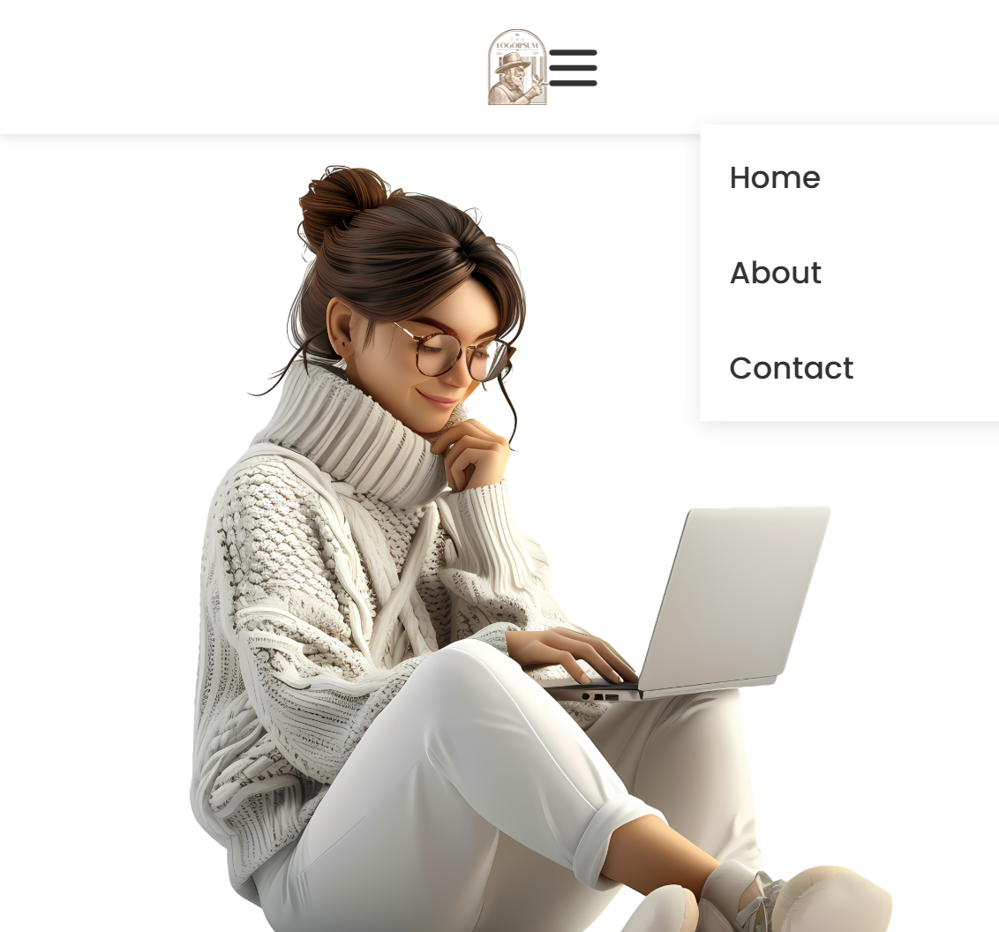

# Membuat Navbar Responsive

## Deskripsi
halaman web responsif yang menampilkan halaman utama untuk pencarian pekerjaan dan showcase perusahaan. Halaman ini dibuat menggunakan HTML dan CSS dengan desain modern dan mobile-friendly.

Halaman ini memiliki tampilan bersih, navigasi yang mudah, dan mendukung tampilan responsif untuk berbagai ukuran layar.

## Responsive
